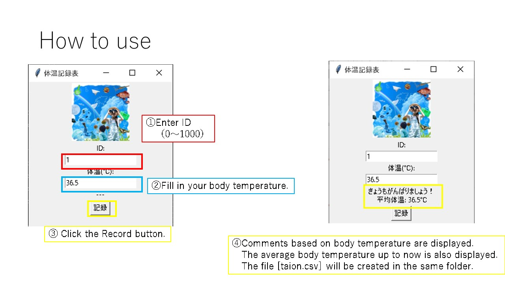

# Medical-temp-check-sheet
------
This is a tool to support those who routinely check their body temperature due to Covid-19.
## How to use
### Files
```
- temp-check-sheet.py   Main unit in operation
- pic.png               Image to load (need not exist)
- taion.csv             If not, it will be created.
```
 
